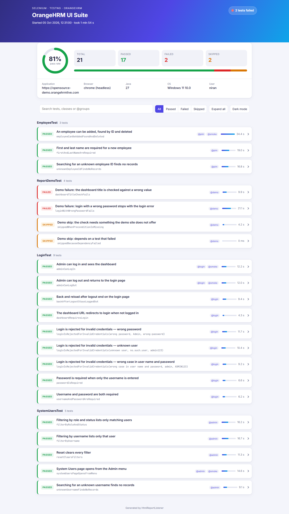
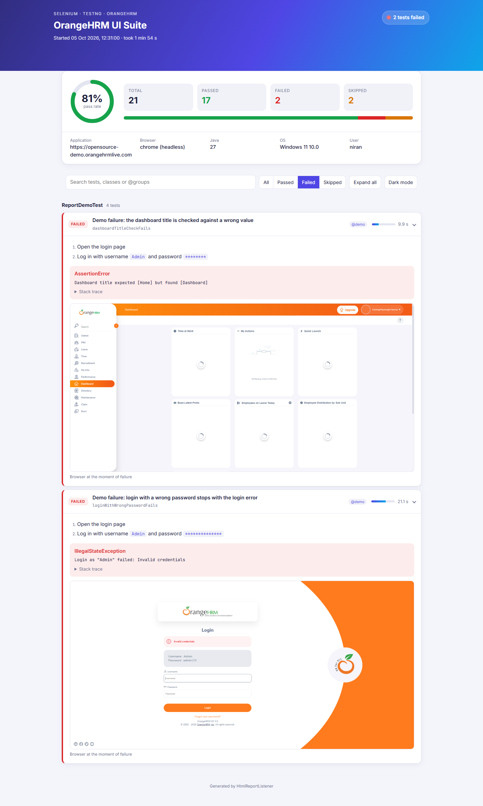

# selenium-java-framework

UI test automation framework for the [OrangeHRM open source demo](https://opensource-demo.orangehrmlive.com/web/index.php/auth/login), built with **Java 17, Selenium 4 and TestNG** using the Page Object Model.

It covers login and logout, access control (Back after logout, protected URLs), searching the Admin user list, and the PIM employee life cycle (add → find → delete, required fields), plus the Selenium scenarios and TestNG features that interviews ask about (see [Interview questions](#interview-questions)). Test classes run in parallel, each test in its own browser, and every run produces a self-contained HTML report with the steps of each test and a screenshot of every failure.



*Report of the core and demo tests (`mvn clean test -Pdemo -Dgroups=login,admin,pim,demo`): 21 tests, 17 passed, 2 failed and 2 skipped on purpose, grouped by class with groups and durations.*

## Tech stack

| | |
|---|---|
| Language | Java 17 |
| Browser automation | Selenium WebDriver 4.50 (Selenium Manager downloads the driver) |
| Test runner | TestNG 7.12 (groups, data providers, parallel classes) |
| Build | Maven (Surefire 3.5) |
| Report | Custom TestNG `IReporter`: one HTML file, no extra dependencies |

## Project structure

```
selenium-java-framework
├── docs/images/                      Report screenshots used in this README (overview, failures)
├── docs/interview-questions.pdf       Selenium + TestNG interview questions with answers
├── pom.xml
├── testng.xml                         Suite for running from the IDE
└── src
    ├── main/java/com/automation/selenium
    │   ├── config      Config: config.properties + -D overrides
    │   ├── driver      DriverManager: one browser per thread (chrome / firefox / edge, headless)
    │   ├── pages       BasePage (explicit waits, OrangeHRM widgets), AppPage (menu, user menu),
    │   │               LoginPage, DashboardPage, SystemUsersPage,
    │   │               EmployeeListPage, AddEmployeePage, EmployeeProfilePage
    │   ├── report      HtmlReportListener (custom HTML report)
    │   └── utils       Steps: records test steps for the report; Links: HTTP status of a link
    ├── main/resources/META-INF/services   Registers the report listener with TestNG
    ├── test/java/com/automation/selenium
    │   ├── base        BaseTest: browser per test, screenshot on failure; RetryOnce: retry analyzer
    │   ├── data        TestData: data providers, generated employees
    │   └── tests       LoginTest, SystemUsersTest, EmployeeTest,
    │                   SeleniumScenariosTest, TestNgFeaturesTest (group interview),
    │                   ReportDemoTest (fails and skips on purpose, group demo)
    └── test/resources/config.properties
```

## How it works

- **Page objects** hold every locator and action; tests only call methods such as `loginAsAdmin().openAdmin().filterByUsername("Admin").search()` and assert on the results.
- **No `Thread.sleep`, no implicit waits.** `BasePage` wraps each action in an explicit wait that ignores stale elements (OrangeHRM re-renders forms and tables after each load), and waits for the loading spinner after searches.
- **OrangeHRM widgets** are handled once in `BasePage`: fields are found by their visible label (`input("Username")`), buttons by their text (`button("Search")`), custom drop-downs (`choose("User Role", "Admin")`, `options(...)`), results tables are read as rows of *column title → text*, plus toasts, validation messages and the "Records Found" count. Pages are opened by path with `openPath("/auth/login")`, so the base URL lives only in `config.properties`.
- **Parallel-ready.** `DriverManager` keeps one `WebDriver` per thread, and every test method gets a fresh browser, so tests never share state.
- **Independent of shared data.** The demo site is public and changes all the time, so the checks never depend on how many records exist, only on every listed record matching the filter. The PIM test creates its own employee with a random ID and deletes it again.
- **Cleanup even when a test fails.** `BaseTest` takes the failure screenshot, then calls `cleanUp()`, then closes the browser. `EmployeeTest` overrides it to delete an employee that a failed run left behind, and its cleanup steps appear in the report under the failed test.
- **Steps for the report.** Page methods record what they do (`Steps.log`), e.g. *Filter by username "Admin"*; passwords are masked.

## Tests

| Class | Group | Tests |
|---|---|---|
| `LoginTest` | `login` | Admin can log in (`smoke`) · invalid credentials are rejected (data provider: wrong password, unknown user, wrong case) · username and password required · password required · admin can log out (`smoke`) · Back and reload after logout end on the login page · the dashboard URL redirects to login when logged out |
| `SystemUsersTest` | `admin` | System Users opens from the menu (`smoke`) · filter by username · filter by role and status · unknown username finds no records · Reset clears every filter |
| `EmployeeTest` | `pim` | An employee can be added, found by ID and deleted (`smoke`) · first and last name are required · unknown employee ID finds no records |
| `SeleniumScenariosTest` | `interview` | Read a list of elements · find broken links · read a custom drop-down's options · log in with keyboard actions · open a second tab and switch windows · run JavaScript · take an element screenshot |
| `TestNgFeaturesTest` | `interview` | `SoftAssert` · `expectedExceptions` · `priority` + `dependsOnMethods` · `invocationCount` (runs twice) · `retryAnalyzer` · `@Parameters` with `@Optional` |
| `ReportDemoTest` | `demo` | Fail and skip **on purpose** (see below) |

A normal run has 32 tests: 17 core tests and 15 interview tests (data providers and `invocationCount` add runs). It takes about 3 minutes on 3 threads.

### Demo tests: failed and skipped results

`ReportDemoTest` shows how the framework and the report handle every outcome, not just passes:

| Test | Result | What the report shows |
|---|---|---|
| Dashboard title checked against a wrong value | Failed (assertion) | `expected [Home] but found [Dashboard]`, stack trace, screenshot |
| Login with a wrong password | Failed (error) | `IllegalStateException: Login as "Admin" failed: Invalid credentials`, screenshot of the login page |
| Precondition missing | Skipped (`SkipException`) | The steps run so far and the skip reason |
| Depends on a failed test | Skipped (dependency) | The test it depends on; it never starts |

Filtered to **Failed**, each failure shows the steps that ran, the error and the browser at the moment of failure:



The `demo` group is left out of normal runs (`excludedGroups` in `pom.xml`, `<exclude>` in `testng.xml`), so the build stays green. Include it with the `demo` profile; the build then ends as failed, as it should.

## How to run

Requirements: JDK 17 or newer, Maven, and Chrome (or Firefox/Edge).

```bash
mvn clean test                          # all tests, visible browser
mvn clean test -Dheadless=true          # without a window
mvn clean test -Dgroups=smoke           # one group: smoke, login, admin, pim or interview
mvn clean test -Dtest=LoginTest         # one class
mvn clean test -Dbrowser=edge           # chrome (default), firefox or edge
mvn clean test -Dthreads=1              # run the classes one after another
mvn clean test -Pdemo                   # also run the demo tests (2 fail, 2 skip on purpose)
mvn clean test -Pdemo -Dgroups=demo     # only the demo tests
```

In the IDE, run `testng.xml` or any test class / method directly.

### Configuration

`src/test/resources/config.properties`; every key can be overridden with `-Dkey=value`:

| Key | Default | Meaning |
|---|---|---|
| `baseUrl` | `https://opensource-demo.orangehrmlive.com` | Application under test |
| `browser` | `chrome` | `chrome`, `firefox` or `edge` |
| `headless` | `false` | Run without a window |
| `timeoutSeconds` | `15` | Explicit wait timeout |
| `username` / `password` | `Admin` / `admin123` | Demo administrator |

## Reports

| Output | Location |
|---|---|
| Custom HTML report | `target/surefire-reports/selenium-test-report.html` (`test-output/` when run from the IDE) |
| Failure screenshots | `target/screenshots/<Class>_<method>_<time>.png` (also embedded in the report) |
| TestNG / Surefire reports | `target/surefire-reports/` |

The HTML report shows the verdict, pass rate, the environment (application, browser, Java, OS), and every test grouped by class with its groups, duration, recorded steps, failure message, filtered stack trace and screenshot. Skipped tests show their reason (a `SkipException` message, or the failed test they depend on). It has search, status filters, expand/collapse all, a dark mode and print styles, and works offline as a single file.

## Interview questions

[`docs/interview-questions.pdf`](docs/interview-questions.pdf) has Selenium and TestNG interview questions with model answers. Many answers point to this framework, and the coding scenarios are real, commented tests:

- `SeleniumScenariosTest`: each test is one classic Selenium task (broken links, windows, drop-downs, `Actions`, `JavascriptExecutor`, element screenshots), with the technique explained in its Javadoc.
- `TestNgFeaturesTest`: each test uses one TestNG feature on a real check, with what it does and when to use it.

## Known limitations

- Only Chrome has been run; Firefox and Edge are supported by `DriverManager` but not tried yet.
- The public demo site is shared and sometimes slow or down (it has answered 504 Gateway Time-out). Most tests have no retry on purpose; `RetryOnce` exists for tests where a retry is acceptable.
- No CI pipeline is set up yet; `mvn clean test -Dheadless=true` is all a CI job needs.

## Adding a test

1. Add or extend a page object in `pages` (extend `AppPage` for pages after login), keep locators `private static final`, and log each user action with `Steps.log`.
2. Add navigation to the new page from the page that leads to it (e.g. a method in `AppPage` for a side-menu entry).
3. Write the test in `tests`, extending `BaseTest`, and give it a `description` and a group.
4. Put shared or generated data in `TestData`.
5. If the test creates data, remember it in a field and delete it in an overridden `cleanUp()` (see `EmployeeTest`).
